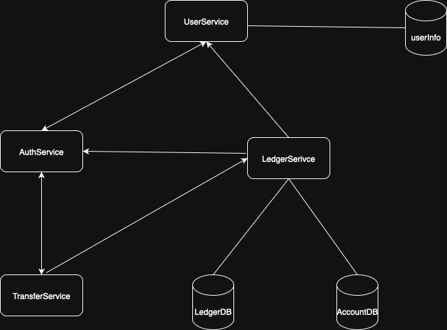
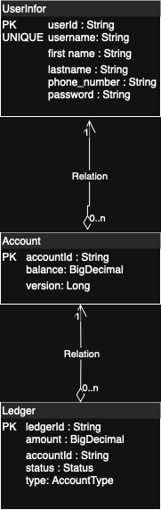

# Read Me First

The following is the solution that contain solution design for the service:
# Getting Started

The solution contains high-level service design and database design

Currently, the auth part and user part are disabled but functionality is working

### Service design
Attached

### database design
